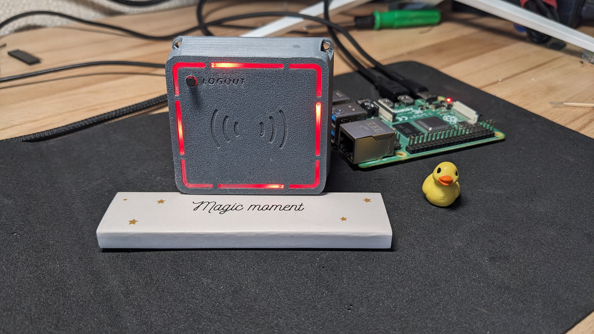
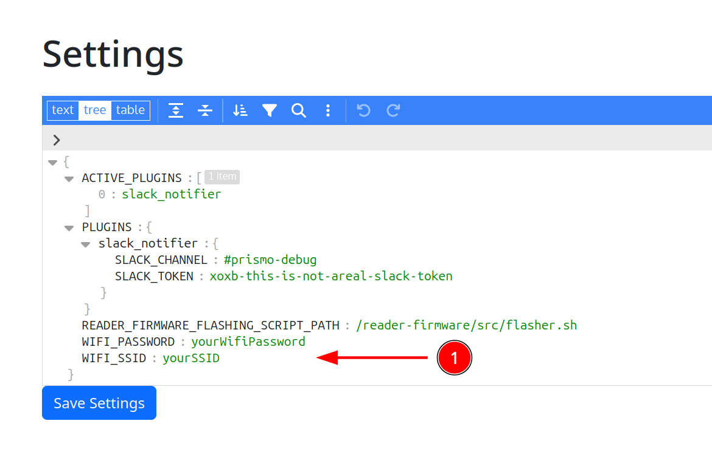
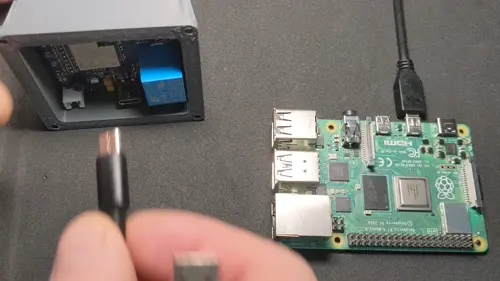
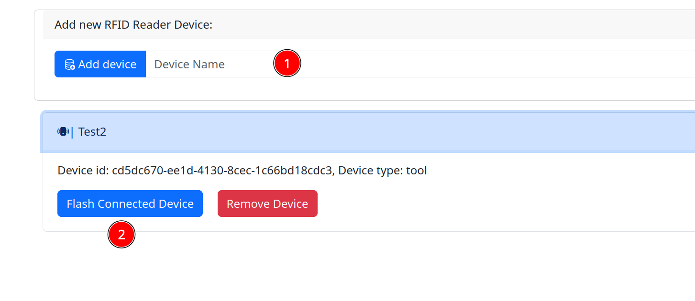
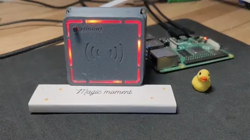
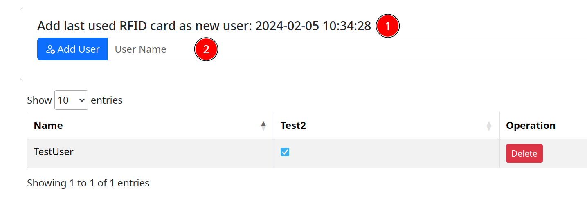
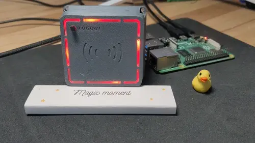

PRISMO Access system
===================

PRISMO is a fully open-source and easy-to-install access system designed to 
control access to tools and equipment in maker spaces. Our goal is to 
create a system that any maker space in the world can easily set up for
its own use. The system is completely open-source, including the backend, 
reader firmware, and PCB schematics.

**⚠️ ☢️ 🚀 Attention!!! Disclaimer!!! ** PRISMO is in early alpha, NOT for production use! 
Expect bugs, limitations, and security risks. Use only in controlled 
environments. We take no responsibility for damages. Contribute 
responsibly!

## Setup on Raspberry Pi OS
Simplest way to bring PRISMO to your life is to use Raspberry Pi and graphical
desktop environment. Here is full description how to do this: [instruction](docs/rpi_installation_instructions.md)

## Reader hardware build

Readers itself has their own repository and building instructions, 
follow [repo](https://github.com/hacklabkyiv/prismo-reader) to build your own beautiful reader.

## Reader software flashing

Once you got your PRISMO Reader, it is time to flash it with firmware. Flashing reader is performed from Raspberry Pi itself. To flash your brand new,
fresh reader you need to perform such steps.
1. Set correct WiFi credentials in system settings. Go go "Settings" Tab in PRISMO webapp(http://prismo.local):

2. Connect your PRISMO Reader HW to Raspberry Pi via USB Cable:

3. Reboot Raspberry Pi
4. Go to "Devices" Tab fill "Device Name" field and Press "Add Device" button.

5. Press "Start" and wait to complete! That is all!

## Add new users to database

Ok, after flashing new reader you can add new tags and users to database.

1. Bring new RFID tag to PRISMO Reader. You should hear "Deny" sound and purple light signal from it.

2. Go to "Users" Tab in PRISMO App, you should see latest time of tag use. Add new user name in field below:

That is all! Now you can toggle checkbox with PRISMO Reader name, and user will have an access for this device!
But to apply changes on PRISMO Reader you need to reboot it or to use any tag again, because reader updates its keys
only during boot or after any key use.

## Contribution

As we said, PRISMO is in early alpha stage, a lot of improvements needed, so
contact us and join our team! We also can provide more detailed instructions about
building HW part.