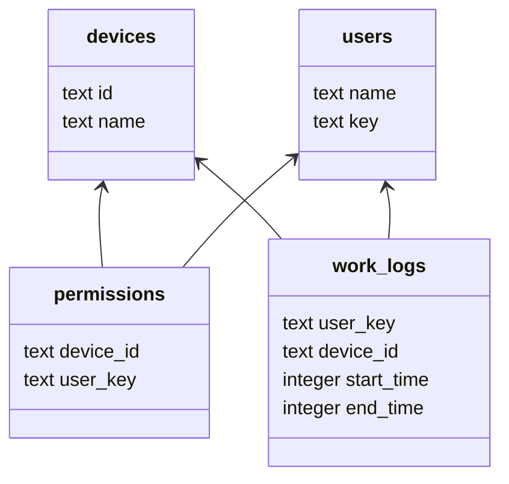

PRISMO Admin Panel
===================

The goal of this web tool is provide basic management capabilities for hackerspaces, like:

1. Presence management basing on MAC address monitoring
2. RFID access system management
3. Payments monitoring
4. Internal information storage(wiki based)

#### Optional steps

By default, this should be run by Prismo admin process, but for debugging purpose you should run this commands by
yourself.

##### Database

We use the sqlite database, the file for database is stored in `database.db` file.

Schema of database:



Create database schema:

```bash
create table devices
(
    id   text not null,
    name text not null
);

create table permissions
(
    device_id text not null,
    user_key  text not null
);

create table users
(
    name text,
    key  text
);

create table work_logs
(
    user_key   text not null,
    device_id  text not null,
    start_time integer,
    end_time   integer
);
CREATE TABLE admins (
    id INTEGER PRIMARY KEY AUTOINCREMENT,
    username TEXT NOT NULL,
    password TEXT NOT NULL
);
````

## Installation

1. Install virtualenv in project's directory:
   ```sh
   $ python3 -m venv ./virtualenv
   ```

2. Activate virtual environment

   ```
   source ./virtualenv/bin/activate
   ```

3. Install required packages:

  ```sh
  pip3 install -r requirements.txt
  ```

4. Run app:

   ```sh
   export FLASK_APP=application.py 
   flask run
   ```
   4.1 Run for debugging and development: (it will reload app on code changes and enable debug mode)
   ```sh
   export FLASK_APP=application.py 
   flask run --debug
    ```
5. Server autostart using `supervisor`

Supervisor is handy tool for autostart different scripts in userspace(supervisord.org). Here is example of configuration
script for this:

  ```
  [program:prismo]
  command=/home/prismo/prismo/.venv/bin/python /home/prismo/prismo/.venv/bin/gunicorn --bind 0.0.0.0:8000 application:app
  directory=/home/prismo/prismo
  startsecs=5
  autostart=true
  autorestart=true
  redirect_stderr=true
  stderr_logfile=/var/log/prismo/prismo.err.log
  stdout_logfile=/var/log/prismo/prismo.out.log  
  ```

6. Nginx setup
   After installation of nginx(`sudo apt install nginx`) edit config `sudo vim /etc/nginx/conf.d/virtual.conf`

  ```
  server {
      listen       80;
      server_name  prismo.local;
  
      location / {
          proxy_pass http://127.0.0.1:8000;
      }
  }
  ```

This config should be placed as `prismo.conf` into `/etc/supervisor/conf.d/`
The application doesn't create any table in database, so you should create it manually. See section "Prepare database"

## Configuration

Currently, config is stored in YAML file. Example of config:

```
app:
    secret_key: some_secret_key
    slat: some_salt
logging:
    debug: Yes
    logfile: log.txt
    logsize_kb: 1000
    rolldepth: 3
slack:
    token: <slack_token>
```

The secret key and slat must be the different values. The secret key is used for session encryption, the salt is used
for admin password hashing. We strongly recommend to generate random values for both of them.

Config file name is `config.cfg`, the file located in the root directory of the project.

## Add admin user

The admin credentials are stored in the database. The admin passwords store in hashed value.

```bash
INSERT INTO admins (username, password) VALUES ('admin', '<hashed admin password>');
```

To generate hashed password, you can use `hash_password.py` script.

- Modify the salt in `hash_password.py` to match the salt in your `config.cfg`
- Modify the password in `hash_password.py` to match the password you want to hash

The script will print the hashed password to the console. Copy this value and insert it into the database.

## Logging

All logs are stored in `log.txt` file.

### Project data structure

All data stored in postgres database. Currently, we have three tables:

- users - the table with users data. It contains three columns: name, key, last_enter. Name is user's name, key is
  unique key (getting from rfid), last_enter is timestamp of last enter to hackerspace.
- permissions - the table with permissions. It contains two columns: device_id and user_key. Device_id is unique id of
  device, user_key is key of user, who has access to this device.
- logs - the table with logs. It contains three columns: timestamp, device_id, user_key. Timestamp is timestamp of
  event, device_id is unique id of device, user_key is key of user, who has access to this device.

## API

#### Get all users with access to device

GET: `/device/user_with_access/<device_id>`

#### User start work with device

POST: `/device/start_work/<device_id>/<user_key>`

#### User stop work with device

POST: `/device/stop_work/<device_id>/<user_key>`
