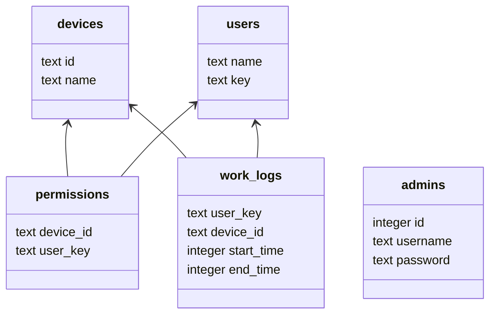

## The database structure

The application creates the database by itself, but you can create it manually by running this SQL commands:

```bash
CREATE TABLE admins (
    id INTEGER PRIMARY KEY AUTOINCREMENT,
    username TEXT NOT NULL,
    password TEXT NOT NULL
);

create table users
(
    name text,
    key  text
);

create table devices
(
    id   text not null,
    name text not null
);

create table permissions
(
    device_id text not null,
    user_key  text not null
);

create table work_logs
(
    user_key   text not null,
    device_id  text not null,
    start_time integer,
    end_time   integer
);
````

The code for creating database is in `app/data/database.py` file.

### Project data structure

All data stored in postgres database. Currently, we have three tables:

- users - the table with users data. It contains three columns: name, key, last_enter. Name is user's name, key is
  unique key (getting from rfid), last_enter is timestamp of last enter to hackerspace.
- permissions - the table with permissions. It contains two columns: device_id and user_key. Device_id is unique id of
  device, user_key is key of user, who has access to this device.
- logs - the table with logs. It contains three columns: timestamp, device_id, user_key. Timestamp is timestamp of
  event, device_id is unique id of device, user_key is key of user, who has access to this device.

#### Database

We use the sqlite database, the file for database is stored in `database.db` file. The file is not created by default.
You need to create it manually. See section "Prepare database"

Schema of database:


