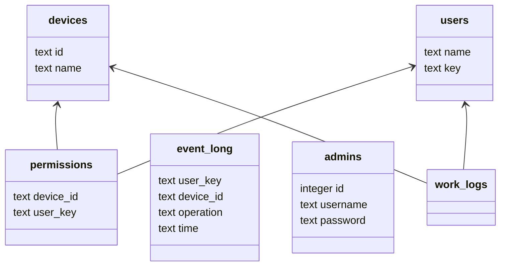

## The database structure

The application creates the database by itself. The code for creating database is in `app/data/database.py` file.

### Project data structure

All data stored in postgres database. Currently, we have three tables:

- users - the table with users data
- permissions - the table with permissions. It contains two columns: device_id and user_key. Device_id is unique id of
  device, user_key is key of user, who has access to this device.
- event_logs - the jornal of all events. It contains four columns: user_key, device_id, operation and time. Operation
  can be `lock`, `unlock`, ...

#### Database

We use the sqlite database, the file for database is stored in `database.db` file. The file is not created by default.
You need to create it manually. See section "Prepare database"

Schema of database:

