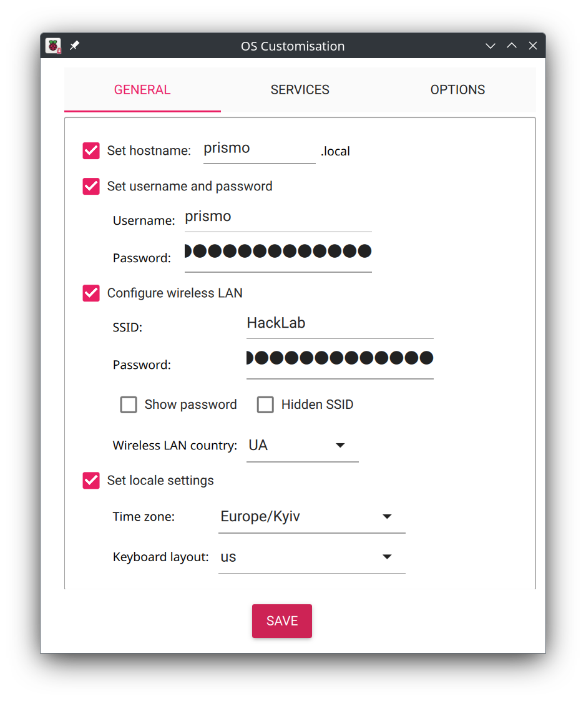

Installing PRISMO Access System on Raspberry Pi OS
==================================================
## Prerequisites:

* Raspberry Pi device
* Raspberry Pi Imager tool(https://www.raspberrypi.com/software/)
* Internet connection

## Raspberry Pi OS installation

Install Raspberry Pi OS as usual:
* Use the Pi Imager tool to flash Raspberry Pi OS onto a microSD card.
* During the initial setup, press "Edit settings" in the "Use OS customization?" dialog.
* Set the hostname to "prismo" (or your preferred hostname).
* Configure the Wi-Fi settings correctly.


    

* Insert the microSD card and power on the Raspberry Pi.

## Install Docker and Docker Compose:

* Open a terminal window and run the following command:
```commandline
curl -sSL https://get.docker.com | sh
```

* Add the current user to the docker group:
```commandline
sudo usermod -aG docker ${USER}
```

* Reboot the Raspberry Pi:
```commandline
sudo reboot
```

* Clone the PRISMO Repository and run docker script:

```commandline
git clone https://github.com/hacklabkyiv/prismo.git
cd prismo
./docker-run.sh
```


* Access PRISMO: Open a web browser on your computer or mobile device.
Navigate to the address `prismo.local` (or the hostname you set).
You should see the PRISMO entry screen.